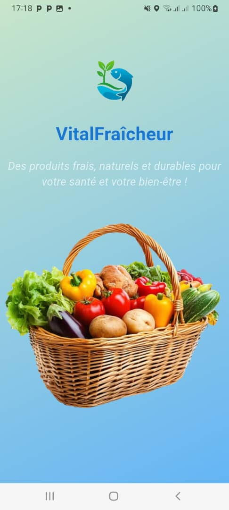
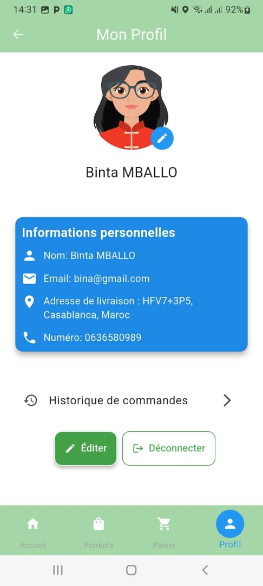
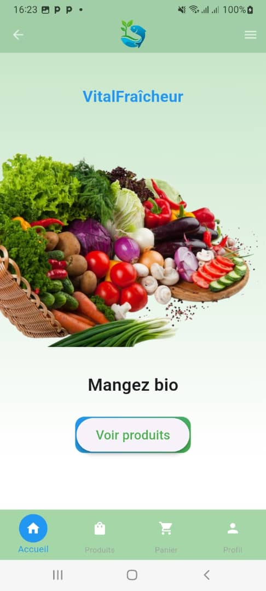
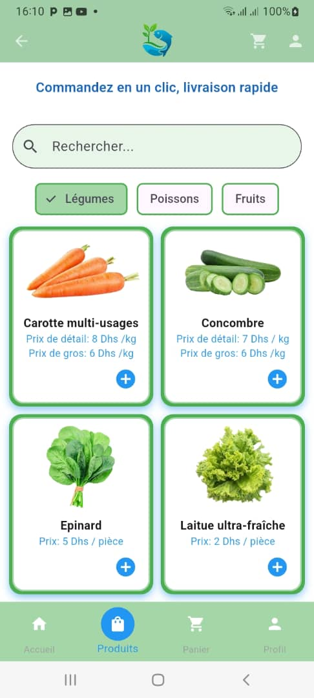
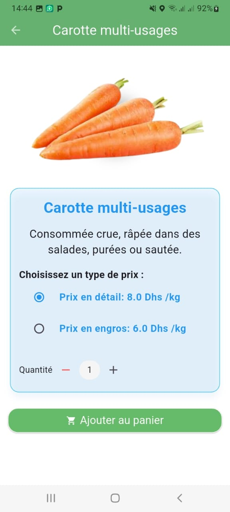
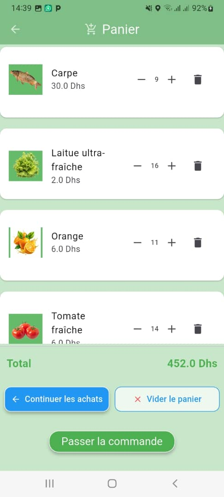
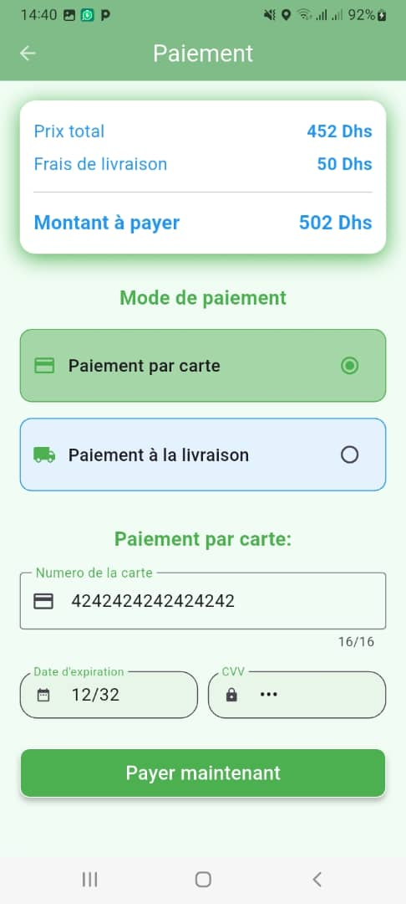
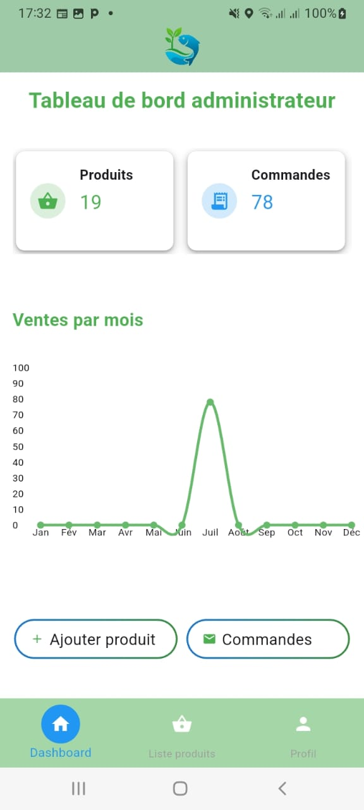

# VitalFraîcheur

C'est une application mobile dédiée à la vente de produits aquaponies. VitalFraîcheur offre une interface intuitive qui permet aux clients de consulter les produits disponibles, d'ajouter des articles à leur panier, de passer des commandes et d'effectuer des paiements en ligne. L'application offre également la possibilité de suivre la livraison en temps réel grâce à un système de géolocalisation.

## Fonctionalités
- Consulter un produit
- Ajouter un produit au panier
- Commander en ligne
- Effectuer le paiement
- Suivre la livraison avec la géolocalisation

## Technologies
- Flutter
- Node.js
- Firebase
- Stripe
  
## Captures d'écran 

<table>
<tr>
<td></td>
<td></td>
<td></td>  
</tr>
</table>

<table>
<tr>
<td></td>
<td></td>
<td></td>  
</tr>
</table>

<table>
<tr>
<td></td>
<td></td>
<td></td>  
</tr>
</table>

<table>
<tr>
<td></td>
<td></td>
<td></td>  
</tr>
</table>

<!--  -->

## Auteur
 Oumou DRAME

## Getting Started

This project is a starting point for a Flutter application.

A few resources to get you started if this is your first Flutter project:

- [Lab: Write your first Flutter app](https://docs.flutter.dev/get-started/codelab)
- [Cookbook: Useful Flutter samples](https://docs.flutter.dev/cookbook)

For help getting started with Flutter development, view the
[online documentation](https://docs.flutter.dev/), which offers tutorials,
samples, guidance on mobile development, and a full API reference.
